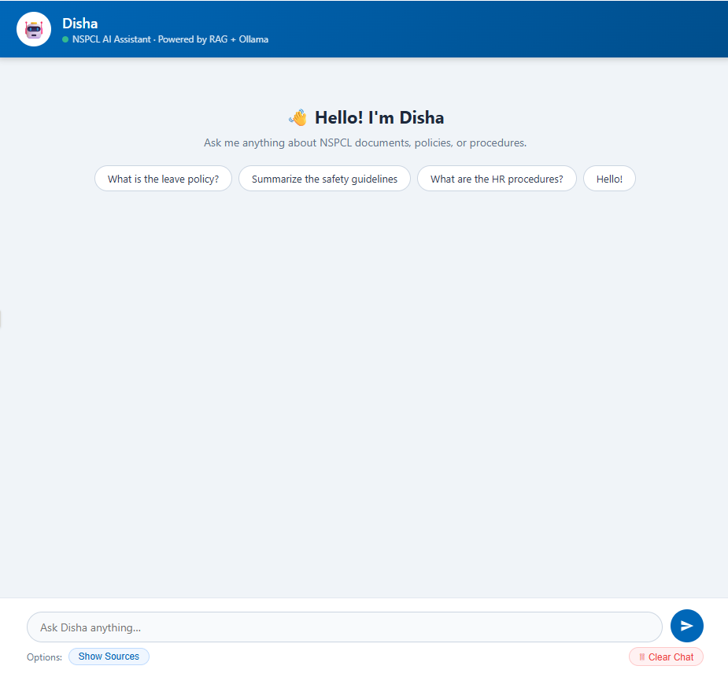

# 🤖 Disha — NSPCL AI Chatbot

> An enterprise RAG-based chatbot built with **Ollama + ChromaDB + LangChain + FastAPI**.  
> Disha answers questions grounded in company documents — no hallucinations, no guessing.

---

## Architecture

```
User Query
    │
    ▼
FastAPI (/query/)
    │
    ├── Conversation History (session-aware, multi-turn)
    │
    ▼
LangChain RAG Chain
    ├── ChromaDB Retriever (MMR search, top-k chunks)
    ├── Prompt Template (grounded, no-hallucination instructions)
    ├── Ollama LLM (phi3:14b, local inference)
    └── StrOutputParser
    │
    ▼
Response (answer + sources + latency)
```

---

## Features

- **RAG Pipeline** — answers grounded in your documents, not model memory
- **Multi-turn Conversations** — session-based history across multiple questions
- **Streaming Support** — token-by-token streaming via Server-Sent Events
- **Source Transparency** — returns which documents were used to answer
- **Configurable via `.env`** — swap models, paths, collections without touching code
- **Document Ingestion Script** — ingest PDF, TXT, DOCX files into ChromaDB
- **Production-ready** — CORS, logging, error handling, latency tracking.

---

## Tech Stack

| Layer | Technology |
|---|---|
| API Framework | FastAPI |
| LLM | Ollama (`mistral`) |
| Embeddings | Ollama (`mxbai-embed-large`) |
| Vector Store | ChromaDB |
| Orchestration | LangChain |
| Config | Pydantic Settings + `.env` |

---

## Quick Start

### 1. Prerequisites

- [Ollama](https://ollama.com) installed and running
- Pull required models:
```bash
ollama pull mistral
ollama pull mxbai-embed-large
```

### 2. Clone & Install

```bash
git clone https://github.com/YOUR_USERNAME/disha-chatbot.git
cd disha-chatbot
pip install -r requirements.txt
```

### 3. Configure

```bash
cp .env.example .env
# Edit .env with your paths and model names
```

### 4. Ingest Your Documents

```bash
python scripts/ingest.py --source ./docs
```

Supports `.pdf`, `.txt`, `.docx` files.

### 5. Run the API

```bash
uvicorn app.main:app --host 0.0.0.0 --port 8000 --reload
```

Visit `http://localhost:8000/docs` for the interactive Swagger UI.

---

## API Reference

### `POST /query/`
Ask Disha a question.

**Request:**
```json
{
  "query": "What is the leave policy at NSPCL?",
  "session_id": "user-abc-123"
}
```

**Response:**
```json
{
  "answer": "The leave policy at NSPCL includes...",
  "session_id": "user-abc-123",
  "sources": ["docs/hr_policy.pdf"],
  "latency_ms": 1243.5
}
```

### `POST /query/stream`
Same as above but streams tokens via SSE.

### `GET /history/{session_id}`
Get conversation history for a session.

### `DELETE /history/{session_id}`
Clear conversation history for a session.

### `GET /health`
Check service status and loaded models.

---

## Project Structure

```
disha-chatbot/
├── app/
│   ├── main.py          # FastAPI app, routes
│   ├── chain.py         # RAG chain builder
│   ├── config.py        # Settings from .env
│   └── history.py       # Session-based conversation memory
├── scripts/
│   └── ingest.py        # Document ingestion into ChromaDB
├── docs/                # Put your source documents here
├── .env.example
├── .gitignore
├── requirements.txt
└── README.md
```

---

## Why Local LLMs?

This project uses **Ollama** to run LLMs entirely on-premise — no data leaves your server. This is critical for enterprise environments like power companies where document confidentiality is non-negotiable.

---

## Reference Image



------

## Author

**Nandini Jampana** — nandinijampana528@gmail.com  
[GitHub](https://github.com/nandinijampana528/) · [LinkedIn](https://www.linkedin.com/in/nandini-jampana-714524172/)
